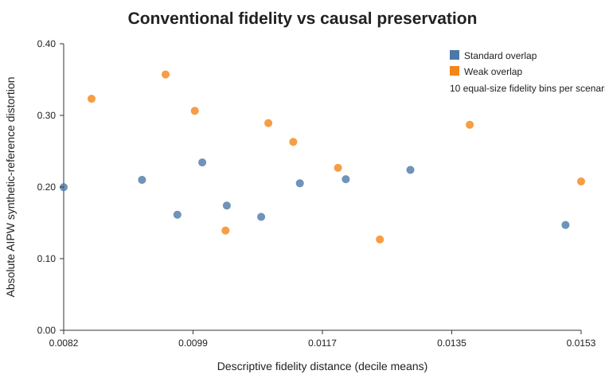
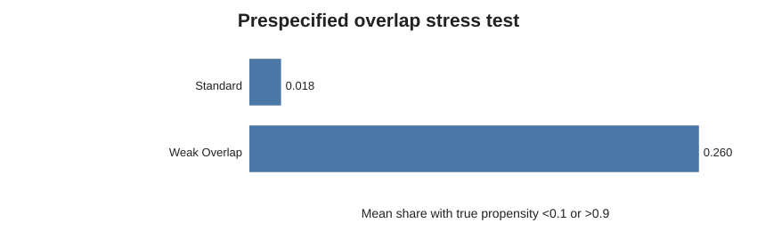
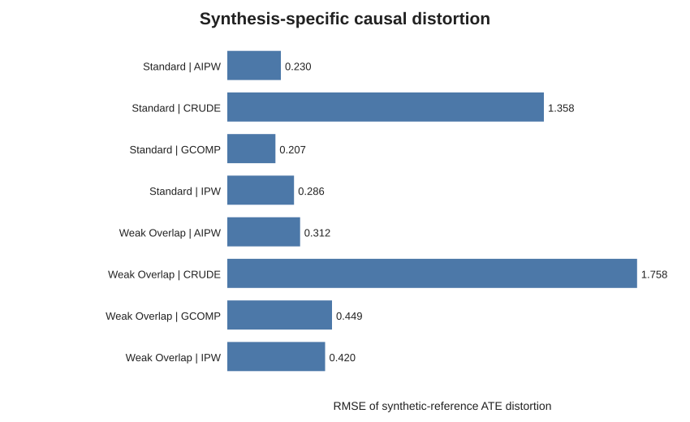

# Causal Utility of Synthetic Health Data

**A semi-synthetic Monte Carlo study of whether strong statistical fidelity in synthetic health data actually preserves a downstream causal analysis.**

---

## Results first

### Headline result

> **High conventional synthetic-data fidelity does not guarantee preservation of a causal treatment-effect analysis.**
>
> In this experiment, Gaussian-copula synthetic data are very difficult to distinguish from their matching reference data using standard fidelity diagnostics, yet the downstream causal estimate and its uncertainty are not perfectly preserved. The gap becomes larger when treatment overlap is weak.

### What happened in the primary AIPW analysis?

The true ATE is **2.0**. The main experiment uses **100 Monte Carlo replications per scenario**, **4,000 observations per replicate**, and the same cross-fitted AIPW estimator on reference and synthetic data.

| Scenario | Data | Mean ATE | Bias | RMSE vs truth | RMSE vs matching reference | 95% coverage |
|---|---|---:|---:|---:|---:|---:|
| Standard overlap | Reference | **1.989** | -0.011 | **0.191** | 0.000 | **0.96** |
| Standard overlap | Gaussian copula | **1.960** | -0.040 | **0.261** | **0.230** | **0.86** |
| Weak overlap | Reference | **2.082** | 0.082 | **0.285** | 0.000 | **0.93** |
| Weak overlap | Gaussian copula | **2.113** | 0.113 | **0.307** | **0.312** | **0.86** |

### Interpretation

There are three distinct messages in this table:

1. **The point estimate is preserved reasonably well on average.** Mean AIPW estimates remain close to the true ATE of 2 in both scenarios.
2. **The synthetic analysis does not reproduce the reference analysis exactly.** Synthetic-reference AIPW distortion has RMSE **0.230** under standard overlap and **0.312** under weak overlap.
3. **Inferential behavior is less well preserved than the point estimate.** AIPW coverage is **0.86** on synthetic data in both scenarios, compared with **0.96** and **0.93** on the corresponding reference data. These coverage estimates are based on 100 replications, so small differences should not be overinterpreted, but the pattern is diagnostically important.

### Result 1 — conventional fidelity looks excellent

| Scenario | Descriptive fidelity distance ↓ | Real-vs-synthetic AUC | Correlation distortion ↓ |
|---|---:|---:|---:|
| Standard overlap | **0.0110** | **0.516** | **0.054** |
| Weak overlap | **0.0114** | **0.517** | **0.060** |

A real-vs-synthetic classifier AUC near **0.5** means that the classifier has little ability to distinguish reference from synthetic rows. On conventional tabular diagnostics, the Gaussian-copula releases therefore look very good.

**But that is not enough.** The same releases still produce non-trivial distortion of the causal analysis. Across the 100 replications, the correlation between marginal descriptive-fidelity distance and absolute AIPW synthetic-reference distortion is only **-0.059** under standard overlap and **-0.173** under weak overlap. In this experiment, conventional marginal fidelity provides little useful ranking information about which synthetic releases best preserve the causal estimate.

<p align="center">
  
</p>

**Reading the figure:** moving left means better descriptive fidelity; moving down means better causal preservation. If ordinary fidelity were a strong proxy for causal utility, releases should line up clearly along a downward relationship. They do not.

### Result 2 — weak overlap makes causal preservation harder

The weak-overlap scenario changes the treatment assignment mechanism while leaving the true ATE unchanged.

| Overlap diagnostic | Standard overlap | Weak overlap |
|---|---:|---:|
| True propensity outside 0.1–0.9 | **1.84%** | **26.03%** |
| Mean estimated IPW effective sample size | **≈ 3,120 / 4,000** | **≈ 1,610 / 4,000** |
| AIPW synthetic-reference distortion RMSE | **0.230** | **0.312** |
| IPW synthetic-reference distortion RMSE | **0.286** | **0.420** |

**Interpretation:** when positivity deteriorates, causal adjustment becomes more sensitive to changes in the joint distribution. The synthetic data can still look highly realistic marginally while being less reliable for reproducing the downstream causal analysis.

<p align="center">
  
</p>

### Result 3 — being closer to the truth is not the same as preserving the original analysis

The semi-synthetic design lets us evaluate two different questions:

- **Truth-relative performance:** how close is an estimator to the known ATE of 2?
- **Preservation:** how close is the synthetic-data estimate to the estimate obtained from its matching reference dataset?

These can disagree.

Under weak overlap, for example, g-computation has RMSE **0.611** relative to truth on the reference data and **0.336** on the Gaussian synthetic data. The synthetic estimate therefore looks *better* relative to truth, yet its synthetic-reference distortion RMSE is still **0.449**.

That is not a contradiction. It means synthesis changed the analysis enough to move the estimator in a favorable numerical direction. For synthetic-data utility, that should not be mistaken for faithful preservation.

<p align="center">
  
</p>

### What the project supports

> **For responsible secondary analysis of synthetic health data, utility should be evaluated against the downstream causal estimand and inferential task—not inferred from marginal, correlation, or predictive fidelity alone.**

### What the project does *not* claim

- It does **not** show that all synthetic data are unsuitable for causal research.
- It does **not** claim that the Gaussian copula is state of the art or universally representative of synthetic-data generators.
- It does **not** estimate a real clinical effect from BRFSS; BRFSS supplies baseline covariates only.
- It does **not** establish anonymity, disclosure protection, membership-inference resistance, or differential privacy.
- It does **not** report scientific CTGAN results; CTGAN remains an optional integration only.

For a short verbal explanation and technical interview defense, see [`docs/interview_prep.md`](docs/interview_prep.md).

---

## Research question

**When do synthetic health datasets preserve the answer to a causal research question, and when can conventional statistical fidelity be misleading about their usefulness for causal inference?**

The project deliberately separates four ideas that are often conflated:

1. **Distributional fidelity** — does the synthetic table resemble the reference table?
2. **Predictive utility** — do models trained on synthetic data transfer to reference data?
3. **Mechanism preservation** — are treatment-assignment and outcome relationships retained?
4. **Causal/inferential utility** — is a prespecified ATE, together with uncertainty and scientific conclusions, preserved?

The contribution is the evaluation framework and empirical stress test, not a claim that one synthesizer is universally best.

## Study design

| Component | Primary design |
|---|---|
| Empirical covariates | 2022 BRFSS reduced extract; 8 baseline variables |
| Treatment | Simulated binary exposure with nonlinear confounding |
| Outcome | Simulated continuous health-risk score in arbitrary units |
| Ground truth | Both potential outcomes retained outside the analysis frame |
| Estimand | ATE = E[Y(1)-Y(0)] = 2 |
| DGP scenarios | Standard overlap; weak-overlap stress test |
| Primary synthesizer | Empirical Gaussian copula |
| Optional extension | CTGAN integration is available but not part of the reported primary experiment |
| Estimators | Crude difference, g-computation, IPW, cross-fitted AIPW |
| Conventional utility | KS, total variation, correlations, classifier AUC/pMSE, TSTR |
| Causal utility | ATE error, bias, RMSE, synthetic-reference distortion, coverage, SE calibration |
| Main Monte Carlo | n = 4,000; 100 replications per scenario; seed = 20260811 |
| Software | Python package, YAML experiments, pytest, Ruff, GitHub Actions |

### Causal graph

```text
        X ─────► D
        │       │
        │       ▼
        └─────► Y
```

Only baseline `X` comes from BRFSS. Treatment `D` and outcome `Y` are generated by the known DGP. Counterfactual outcomes, true propensities, and individual treatment effects are never passed to the synthesizer or causal estimators.

## Data

The working source is a pre-existing reduced 2022 BRFSS coursework extract containing **445,132 records**. Restricting the data to the eight prespecified baseline variables and applying invalid-code and study-specific BMI plausibility rules leaves a **324,636-row complete-case covariate pool (72.9%)**.

Core covariates:

`age_group`, `female`, `education`, `income`, `bmi`, `active`, `diabetes`, `general_health`.

The raw and processed respondent-level files are intentionally excluded from git. See [`data/README.md`](data/README.md) for provenance and variable decisions.

## Mathematical data-generating model

The semi-synthetic design uses empirical BRFSS baseline covariates but a fully known treatment and outcome mechanism. This makes the causal truth observable for evaluation while preserving a realistic covariate distribution.

### Notation and standardization

For individual $i$, define

- $A_i$: age, represented by the midpoint of the BRFSS age group;
- $B_i$: BMI;
- $I_i$: income category;
- $G_i$: general-health category;
- $E_i$: education category;
- $F_i$: female indicator;
- $P_i$: physical-activity indicator;
- $C_i$: diabetes indicator.

For $V\in\{A,B,I,G,E\}$, the standardized variable used by the structural DGP is

$$
Z_{V,i}=\frac{V_i-\bar V}{s_V},
\qquad
s_V^2=\frac{1}{n}\sum_{i=1}^{n}(V_i-\bar V)^2.
$$

Standardization is recomputed within each Monte Carlo reference sample, exactly as in the implementation.

### Treatment-assignment model

First define the nonlinear treatment score

$$
\begin{aligned}
r_i ={}&
0.35Z_{A,i}
+0.25Z_{B,i}
-0.30Z_{I,i}
+0.35Z_{G,i}
+0.45C_i
-0.25P_i
+0.10F_i \\
&+0.18Z_{A,i}C_i
+0.12\left(Z_{B,i}^2-1\right).
\end{aligned}
$$

The propensity score is logistic:

$$
e_i
\equiv
\Pr(D_i=1\mid X_i)
=
\Lambda\!\left(\alpha_s+\kappa_s r_i\right),
\qquad
\Lambda(u)=\frac{1}{1+e^{-u}}.
$$

The overlap parameter is

$$
\kappa_s=
\begin{cases}
1, & \text{standard overlap},\\
2, & \text{weak overlap}.
\end{cases}
$$

For every Monte Carlo replicate, the intercept $\alpha_s$ is numerically calibrated so that the mean treatment probability is 0.45:

$$
\frac{1}{n}\sum_{i=1}^{n}
\Lambda\!\left(\alpha_s+\kappa_s r_i\right)
=0.45.
$$

Treatment is then generated as

$$
D_i\mid X_i\sim\operatorname{Bernoulli}(e_i).
$$

The weak-overlap scenario therefore changes only the scale of the treatment score; it does **not** change the outcome model or the true treatment effect.

### Potential-outcome model

The conditional mean of the untreated potential outcome is

$$
\begin{aligned}
\mu_{0i} ={}&
50
+2.8Z_{G,i}
+1.5Z_{B,i}
+1.1Z_{A,i}
-1.0Z_{I,i}
-1.2P_i
+2.0C_i \\
&-0.6Z_{E,i}
+0.8\left(Z_{B,i}^2-1\right)
+0.7Z_{A,i}Z_{G,i}.
\end{aligned}
$$

The outcome disturbance is

$$
\varepsilon_i\sim\mathcal N(0,5^2).
$$

The primary experiment imposes a constant individual treatment effect

$$
\tau_i=2.
$$

Hence the two potential outcomes are

$$
Y_i(0)=\mu_{0i}+\varepsilon_i,
$$

$$
Y_i(1)=\mu_{0i}+2+\varepsilon_i,
$$

and the observed outcome is

$$
\begin{aligned}
Y_i
&=(1-D_i)Y_i(0)+D_iY_i(1)\\
&=\mu_{0i}+2D_i+\varepsilon_i.
\end{aligned}
$$

Therefore the individual treatment effect and the population estimand are known exactly:

$$
Y_i(1)-Y_i(0)=2,
\qquad
\tau_{ATE}
=\mathbb E\!\left[Y_i(1)-Y_i(0)\right]
=2.
$$

### Causal identification encoded by the simulation

The observational ATE is evaluated under the standard identification conditions

$$
Y_i(d)\perp D_i\mid X_i,
\qquad d\in\{0,1\},
$$

$$
0<e(X_i)<1,
$$

and consistency,

$$
Y_i=Y_i(D_i).
$$

These conditions are generated by construction; the weak-overlap scenario is a **practical positivity stress test**, not a violation created by deterministic treatment assignment.

### Variable roles in the DGP

- **Confounders:** age, BMI, income, physical activity, diabetes, general health.
- **Treatment-only predictor:** sex.
- **Outcome-only predictor:** education.
- **Effect modification:** none in the primary experiment.

Truth variables $(e_i,Y_i(0),Y_i(1),\tau_i)$ are retained only for evaluation and are removed before either synthesis or causal estimation.

## Mathematical Gaussian-copula synthesis model

The primary synthesizer is applied to the observed analysis vector

```math
W_i=(X_i,D_i,Y_i).
```

It is **not** applied to the truth variables above.

For a continuous variable $W_j$, observed values are mapped to latent normal scores using empirical ranks:

```math
U_{ij}=\frac{R_{ij}-0.5}{n},
\qquad
Z_{ij}=\Phi^{-1}(U_{ij}).
```

Here $R_{ij}$ is the average rank and $\Phi$ is the standard-normal cumulative distribution function.

For a categorical variable with categories $c=1,\ldots,K$ and empirical probabilities $p_c$, define the lower cumulative probability of category $c$ as

```math
L_c=\sum_{h=1}^{c-1}p_h.
```

Category $c$ is represented on the latent scale by the midpoint of its cumulative-probability interval:

```math
Z(c)=\Phi^{-1}\left(L_c+\frac{p_c}{2}\right).
```

Let $Z_i$ denote the complete latent vector. The empirical latent correlation matrix is estimated and projected to a valid correlation matrix, denoted $\widehat{R}$. Synthetic latent observations are then drawn from

```math
Z_i^{\ast}\sim\mathcal{N}\left(0,\widehat{R}\right).
```

They are transformed to uniforms using

```math
U_i^{\ast}=\Phi\left(Z_i^{\ast}\right).
```

Continuous variables are mapped back through empirical quantiles; categorical variables are mapped back through their empirical cumulative probabilities. Thus the Gaussian copula is intended to preserve empirical marginals and approximate dependence while providing a transparent setting in which causal distortion can be measured.

## Estimator hierarchy

- **Crude difference in means:** deliberately confounded benchmark.
- **G-computation:** cross-fitted histogram gradient boosting outcome regression.
- **IPW:** Hájek-normalized weighting with a compact main-effects logistic propensity model. The true treatment DGP contains nonlinearities and an interaction, so IPW is intentionally a misspecification-sensitive benchmark.
- **AIPW:** primary estimator; cross-fitted flexible treatment and outcome nuisance models with influence-function-style standard errors.

The standard errors reported from a single synthetic dataset are analyst-facing model-based SEs; they do not automatically incorporate uncertainty from learning the synthesis model or generating a synthetic release. Monte Carlo coverage is therefore evaluated explicitly.

Mechanism-preservation diagnostics are also reported, but fitted treatment-contrast correlations are treated as secondary under the constant-effect DGP: because the true individual effect is exactly 2, fitted heterogeneity is model approximation/noise rather than true effect modification. See [`docs/limitations.md`](docs/limitations.md) and [`docs/protocol.md`](docs/protocol.md).

## Full results

The completed primary outputs are in [`results/main_gaussian/`](results/main_gaussian/).

Key files:

- [`main_results_table.csv`](results/main_gaussian/main_results_table.csv) — compact reviewer-facing causal results;
- [`causal_summary.csv`](results/main_gaussian/causal_summary.csv) — full Monte Carlo causal summary;
- [`fidelity_summary.csv`](results/main_gaussian/fidelity_summary.csv) — fidelity, predictive, mechanism, and oracle diagnostics;
- [`aipw_release_level.csv`](results/main_gaussian/aipw_release_level.csv) — release-level AIPW/fidelity/overlap records used for the main preservation plot;
- [`overlap_summary.csv`](results/main_gaussian/overlap_summary.csv) — overlap diagnostics;
- [`data_audit.csv`](results/main_gaussian/data_audit.csv) — preprocessing and retention audit;
- [`run_config.json`](results/main_gaussian/run_config.json) — executed experiment configuration.

No respondent-level BRFSS rows and no row-level synthetic datasets are versioned. Full replicate-level outputs are reproducible from the committed configuration and code.

### Figures

Key figures are in [`figures/main_gaussian/`](figures/main_gaussian/):

- `causal_utility_rmse.svg` — truth-relative RMSE for reference and synthetic analyses;
- `reference_distortion_rmse.svg` — synthesis-specific causal distortion by estimator and scenario;
- `fidelity_vs_reference_distortion.svg` — conventional fidelity versus absolute AIPW reference distortion;
- `overlap_scenarios.svg` — standard versus weak-overlap propensity distributions.

## Pilot and validation

The earlier committed pilot contains only **3 replications × 1,500 observations × two scenarios** and remains in [`results/pilot/`](results/pilot/) as a computational validation artifact, not as the evidence base for the conclusions above.

The final execution path was additionally checked by rerunning that exact pilot configuration: its estimator summaries reproduce the committed pilot values exactly. The repository test suite passes compilation, Ruff, and pytest across the configured Python versions in GitHub Actions.

## CTGAN scope

CTGAN remains an optional integration and smoke-tested extension. **No CTGAN scientific result is reported here because the primary completed experiment uses the transparent Gaussian-copula baseline only.** This keeps the application-facing study focused and fully reproducible while avoiding claims from an unexecuted model comparison.

## Repository structure

```text
.
├── README.md
├── pyproject.toml
├── configs/
├── data/
├── src/causal_utility/
├── tests/
├── scripts/
├── results/
├── figures/
├── literature/
├── docs/
└── .github/workflows/
```

## Reproduce

Create an environment and install the core project:

```bash
python -m venv .venv
source .venv/bin/activate      # Windows: .venv\Scripts\activate
pip install -e ".[dev]"
```

Place the reduced source workbook at:

```text
data/raw/Demo+Health data.xlsx
```

Run tests and a smoke experiment:

```bash
pytest
ruff check src tests
causal-utility run --config configs/smoke.yaml --output results/smoke --figures figures/smoke
```

Run the completed primary Gaussian protocol:

```bash
causal-utility run --config configs/main_gaussian.yaml --output results/main_gaussian --figures figures/main_gaussian
```

CTGAN can be installed separately for an optional extension:

```bash
pip install -e ".[dev,ctgan]"
```

See [`docs/reproducibility.md`](docs/reproducibility.md) for details.

## Literature foundation

The design draws on general/specific synthetic-data utility (Snoke et al., 2018), CTGAN for mixed tabular data (Xu et al., 2019), inferential-utility concerns (Decruyenaere et al., 2024), and emerging causal-synthesis work that directly evaluates treatment-effect preservation. See [`literature/review.md`](literature/review.md) and [`literature/references.csv`](literature/references.csv).

## Scope and claims

This repository does **not** claim that synthetic data are anonymous, differentially private, or safe from disclosure attacks. It evaluates causal utility conditional on a synthesis procedure. It also does not claim that the simulated treatment or outcome represents a real BRFSS intervention or clinical endpoint.

See [`docs/limitations.md`](docs/limitations.md).